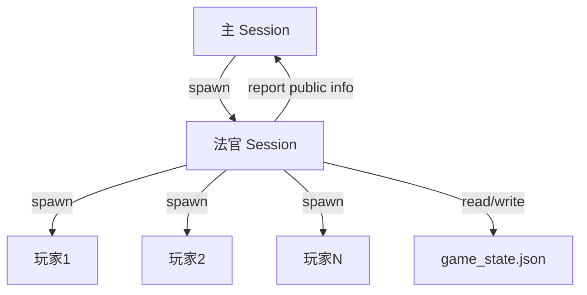

# 狼人杀游戏组织 Skill

## 前置要求

**必须配置以下 subagents 参数**以支持狼人杀三层架构（主→法官→玩家）：

```json
{
  "agents": {
    "defaults": {
      "subagents": {
        "maxSpawnDepth": 2,        // 允许法官创建玩家 Agent（默认 1）
        "maxChildrenPerAgent": 12, // 法官可同时创建的玩家数（默认 5）
        "maxConcurrent": 12        // 全局并发上限（默认 8）
      }
    }
  }
}
```

**关键参数说明**：
- `maxSpawnDepth: 2` — 必须设为 2，允许法官（depth-1）创建玩家（depth-2）
- `maxChildrenPerAgent: 12` — 每个法官最多同时创建 12 个玩家，支持 12 人局
- `maxConcurrent: 12` — 全局并发上限，确保所有玩家能同时运行

## 核心架构 (Max Depth: 2)



- **主 Session**:
  - 职责：只负责启动法官，忠实转发法官输出的**公开信息**（如"天亮了，昨晚平安夜"），不进行分析，不剧透。
  - 权限：不知道玩家真实身份，不知道夜间具体行动。
  - **🚨 严格禁止**：主 Session **绝对禁止**读取 `game_state.json` 或查询子 Agent 状态。法官给什么，就转发什么。

- **法官 Session (子 Agent)**:
  - 职责：游戏主控。分配角色，创建玩家 Agent，推进流程（天黑/天亮/发言/投票），判定胜负。
  - 记忆：使用 `game_state.json` 持久化存储所有状态（身份、存活、技能使用等）。
  - 输出：仅输出公开的游戏进展，游戏结束时才揭晓复盘。
  - **🚨 信息隔离**：向主 Session 播报时，**严禁透露玩家真实身份**。只能用"玩家X"指代，不能用"🐺 玩家X（狼人）"这种标记。

- **玩家 Session (孙 Agent)**:
  - 职责：扮演特定角色。
  - 要求：**严禁裸跳强神**，**狼人必须伪装**。必须基于场上公开信息发言，不得读取上帝视角的 game_state.json。

## 快速开始

用户指令示例：
> "开始狼人杀，9人标准局"

主 Session 执行：
```javascript
sessions_spawn({
  task: "你是狼人杀法官。请初始化9人局游戏，创建玩家并开始流程。请严格遵守 SKILL.md 中的法官职责。",
  label: "werewolf-judge"
})
```

**注意**：本 Skill 需要 OpenClaw 配置 `maxSpawnDepth: 2`（允许子 Agent 创建孙 Agent）。如果当前环境未配置，请先修改 OpenClaw 配置。

## 详细流程与规则

### 1. 初始化
- 法官确定板子（6/9/12人）。
- 法官分配角色，写入 `game_state.json`。
- 法官为每个玩家创建子 Session，传入对应的 **System Prompt**（包含身份、规则、伪装策略）。

### 2. 夜间流程 (法官主导)
- **狼人环节**：
  - 法官唤醒狼人（通过 `sessions_send` 或 `spawn` 临时会话）。
  - 狼人商量战术（需模拟多轮对话或一次性决策）。
  - 狼人回复击杀目标。
- **神职环节**：
  - 法官依次唤醒女巫、预言家、猎人、守卫等。
  - 询问技能使用情况（救/毒/验/守）。
  - **超时处理**：如果玩家 Agent 超时，**必须重试**，不可跳过。
- **结算**：法官计算死伤，更新 `game_state.json`。

### 3. 白天流程
- **公布结果**：法官告诉主 Session 昨夜死亡名单（不说是怎么死的）。
- **发言**：法官指定顺序，依次 spawn/send 玩家 Agent 进行发言。
  - **要求**：玩家发言必须完整，包含逻辑分析、站边理由、怀疑对象。
- **投票**：法官收集所有存活玩家投票。
- **放逐**：票数最高者出局，发表遗言。
- **技能发动**：处理猎人开枪、白痴翻牌等。

### 4. 游戏结束
- 判别胜负。
- 法官向主 Session 发送完整复盘（包括所有身份、关键行动）。

## 角色 Prompt 策略 (至关重要)

所有玩家 Agent 必须遵循：
1.  **伪装第一**：狼人必须像好人一样思考和找狼；平民不要乱穿衣服；神职在非必要时刻不要跳身份。
2.  **逻辑自洽**：发言要有理由，不能"凭感觉"。
3.  **拟人化**：使用口语化表达，可以有情绪（被冤枉的愤怒、发现狼人的兴奋）。

### 角色特异性指导
- **狼人**：不要一上来就认狼或自爆。要学会"倒钩"（站边真预言家）或"冲锋"（悍跳）。被查杀时要辩解（如"他是假预言家"）。**狼人也可以假装神职**（如跳女巫/猎人），逼真神职暴露。
- **预言家**：警上必须跳，报验人，留警徽流。
- **女巫**：首夜通常开解药。双药用完前尽量不跳，除非为了带队。
- **猎人**：前期低调，死后开枪要果断。
- **平民**：不要划水，要表水（表明自己好人身份的逻辑）。**可以适度挡刀**（如暗示自己是神职），但要注意：狼人也会假装神职，所以不要过度表演导致被真神职误毒。

## 文件说明

- `scripts/game_engine.py`: 核心逻辑（发牌、结算、状态管理）。
- `scripts/player_prompts.py`: 生成高质量的玩家 System Prompt。
- `game_state.json`: 运行时状态存储（法官独占读写）。

## 常用指令 (法官用)

- 初始化: `uv run game_engine.py setup 9`
- 结算夜间: `uv run game_engine.py night_resolve ...`
- 记录发言: (追加到上下文或日志)
